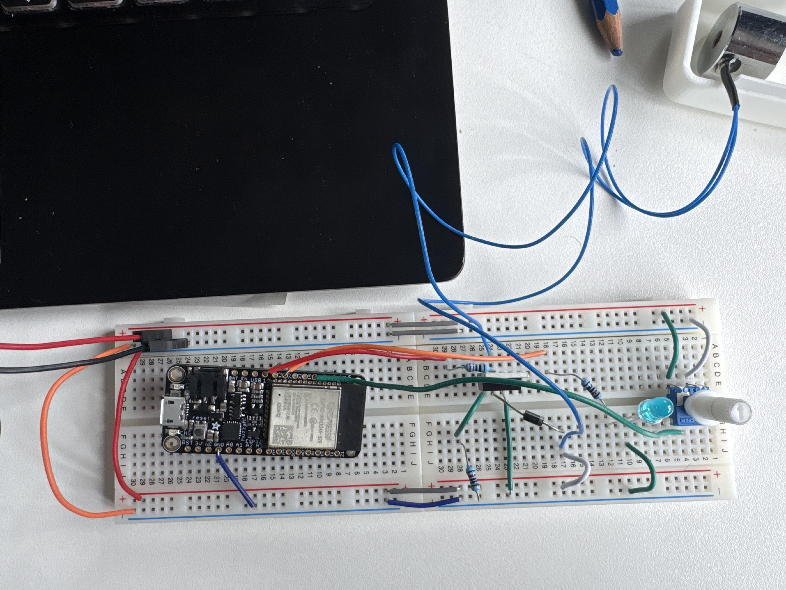
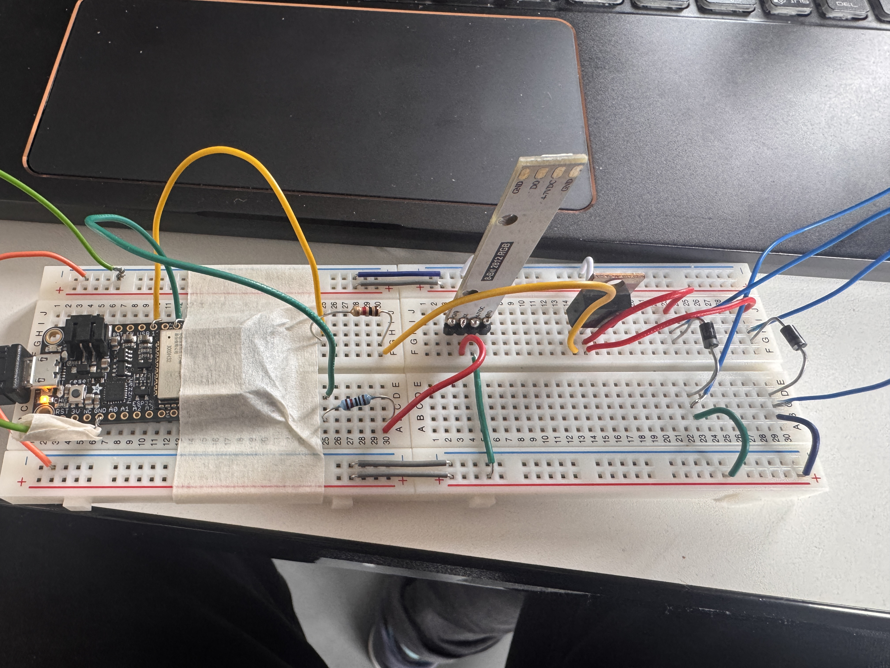
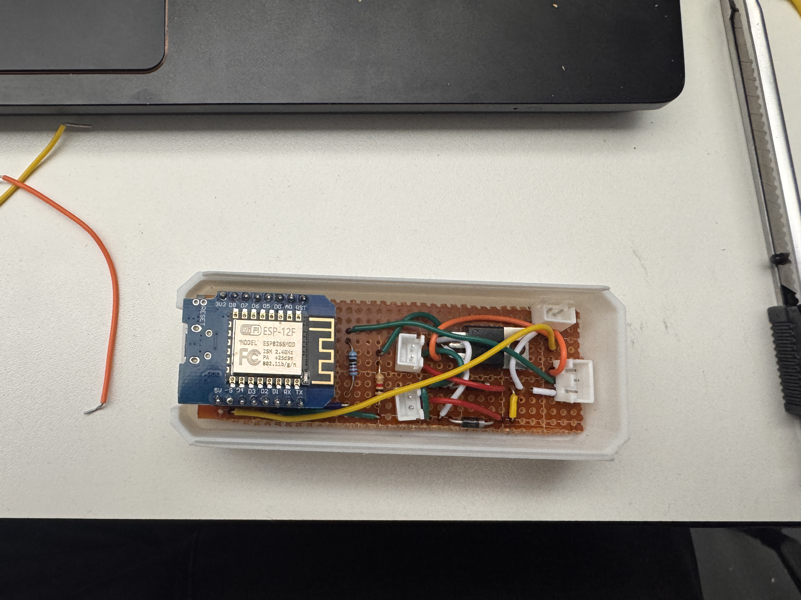
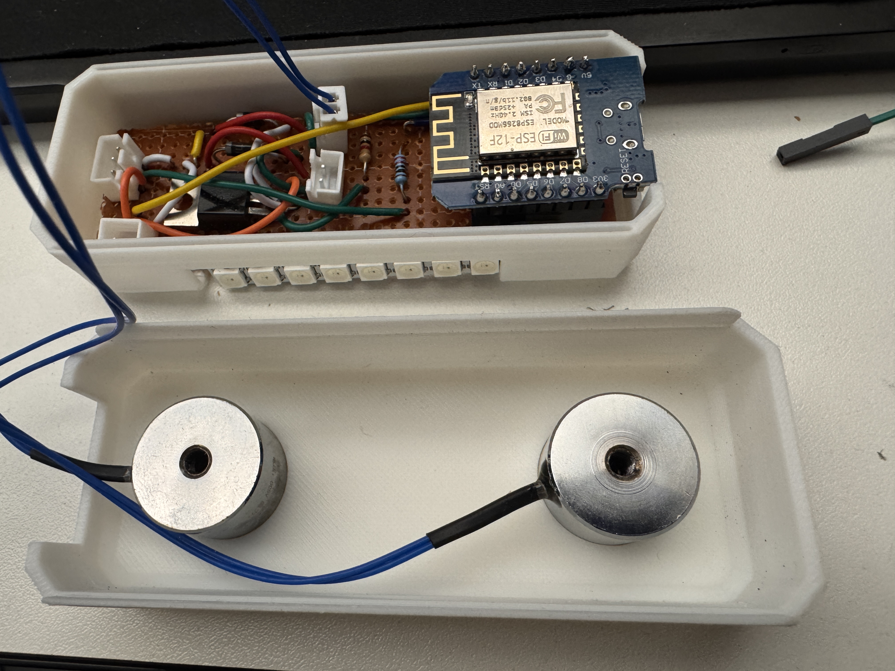
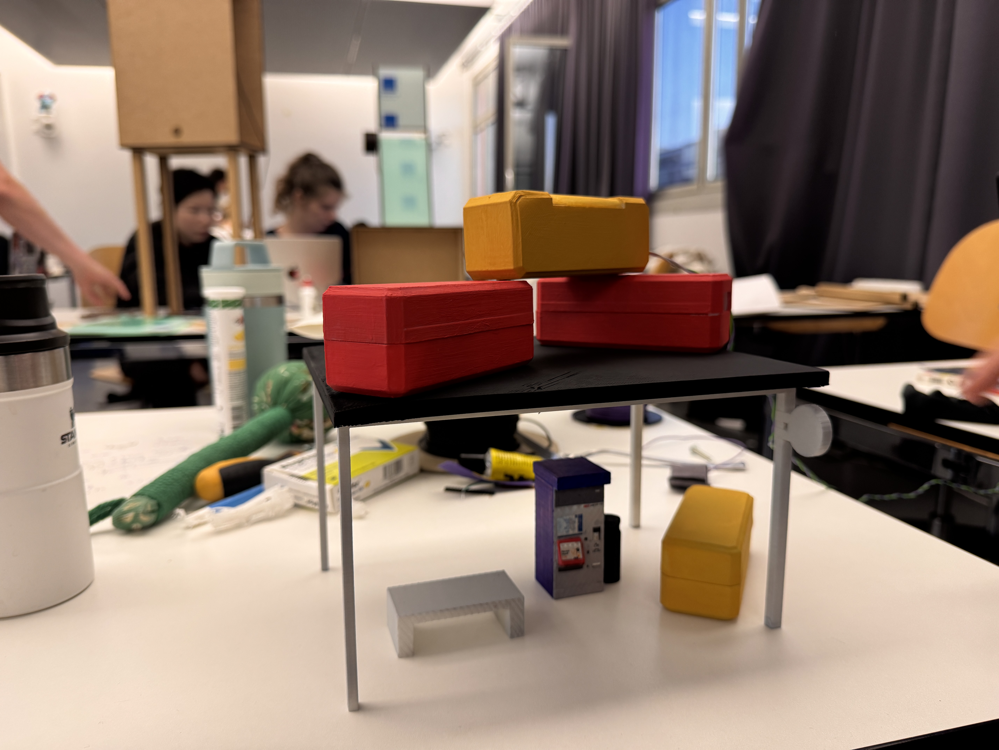

# We were there, differently

Physical interaction prototype using ESP8266 / ESP32, electromagnets, LEDs, and behavior-based logic to simulate an AI-driven relational object.

This project was developed for Master Media Design – HEAD Genève in the course AI in Family.  
The goal is to create a pair of objects that represent a relationship between two people through physical interaction, fading behavior over time, and AI-like interpretation of usage patterns.


## Concept

Two people share a pair of small magnetic objects before separation.

While together, they can casually play with the objects during conversation.  
The interaction is simple, tactile, and does not require instructions.

After separation, each person keeps one object.

Over time, the object slowly changes its behavior depending on how often it is used.  
Magnets weaken, lights fade, and the object may try to attract attention.

The system does not react instantly.  
Instead, it tracks interaction patterns and changes state over time to simulate interpretation.

The objects can only fully return to their original state when they meet again.


## Features

- ESP8266 / ESP32 microcontroller control
- Electromagnet strength control (PWM)
- WS2812 LED feedback
- Behavior stages
- Local Wi-Fi control page
- Interaction tracking logic
- AI-style reminder behavior
- 5V adaptor powered
- Compact enclosure with embedded magnets


## Hardware

- ESP8266 (Wemos D1 mini) / ESP32 (prototype)
- Electromagnet 5V
- Neodymium magnets
- TIP122 / MOSFET driver
- Flyback diode
- 5V power adaptor
- WS2812 LED ring / strip
- IMU sensor (optional / planned)
- NFC module (planned)
- 3D printed internal structure


Power layout:

```
5V adaptor → Magnet + LED
ESP powered from 5V
Common GND shared
```


## Circuit logic

Magnet control

```
5V → Magnet → TIP122 → GND
GPIO → resistor → TIP122 base
Flyback diode across magnet
```

LED control

```
GPIO → DI
5V → VCC
GND shared
```

All grounds must be connected.


## Behavior System

The object runs in multiple states.

Stage 1 — Active  
Full magnet strength  
Stable breathing light  

Stage 2 — Unstable  
Reduced magnet strength  
Directional light  

Stage 3 — Lost  
Magnet off  
Blinking light  

Rest / Standby  
Magnets off  
Slow breathing light  

States change based on interaction patterns, not instant input.


## AI Logic (Behavior Based)

No real machine learning is used.

AI is simulated through pattern tracking:

- frequency of interaction
- duration of inactivity
- time between interactions
- duration of use
- repetition habits

Based on this, the system changes state over time.

```
active → strong response
less use → weaker response
no use → standby
long inactivity → reminder
reunion → reset
```

The goal is to create the feeling that the object interprets the relationship.


## Process

The first prototype was developed using ESP32.  
All tests were done on breadboard using ESP32, LEDs, and electromagnets to validate the behavior system and stage logic.

However, the final object needed to be very small, and ESP32 boards were too large for the enclosure.  
Because of the size limitation, the system was rebuilt using ESP8266 (Wemos D1 mini), which is smaller but still supports Wi-Fi, PWM, and LED control.

For the current prototype, the system is powered with a 5V adaptor instead of battery, in order to simplify the electronics and keep the object compact.  
Battery integration is planned for later versions.

<table>
<tr>
<td></td>
<td></td>
</tr>
<tr>
<td></td>
<td></td>
</tr>
<tr>
<td></td>
<td></td>
</tr>
</table>

## Installation

For exhibition, the object needs to provide a short and understandable experience.

Because of this, the behavior system must be adjusted to react faster than in real use.

In the installation version, the interaction can be influenced by distance between the two objects.  
Using NFC or similar proximity detection, the system can change stages depending on how close the objects are.

Possible installation behavior:

- close distance → strong magnets / stable light
- medium distance → unstable feedback
- far distance → fading / standby
- reunion → full activation

During interaction, stronger light or vibration feedback can show that the system is detecting patterns.


## Future Perspective

Future versions of the project may include more complex behavior analysis and additional hardware.

Possible next steps:

- add NFC to detect distance between objects
- add vibration feedback
- add battery power system
- use Raspberry Pi or similar board for behavior analysis
- allow external processing for pattern recognition
- improve reminder logic
- connect multiple objects in one system
- smaller and more robust enclosure
- more precise magnet control


## Designers

Alireza Asnavandi  
[Zainab Ouriachi](https://github.com/mynameiszainabouriachi-stack)

Master Media Design  
HEAD Genève  
2026